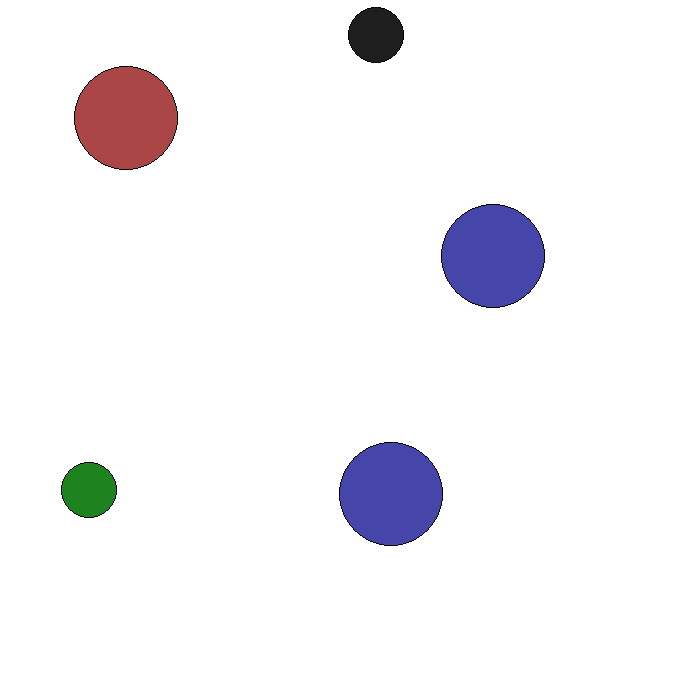

# Implementation of "Theory of Mind as Intrinsic Motivation for Multi-Agent Reinforcement Learning"

This repository contains a rough implementation of the method proposed by Oguntola et al. in their
work "Theory of Mind as Intrinsic Motivation for Multi-Agent Reinforcement Learning". We use the
Simple Adversary environment as described
[here](https://pettingzoo.farama.org/environments/mpe/simple_adversary/) with `N=2` by default.

## Installation

Before proceeding it is important to note that this repository requires python >=3.10 to run.
```
git pull https://github.com/Shr1ftyy/belief-tom
cd belief-tom
pip install -r requirements.txt
```

## Running
Duplicate the `belief.example.yaml` file and run the script.
```
cp belief.example.yaml belief.yaml
python main.py --logging_level debug --config belief.yaml
```

## Preview
 Blue circles are the "good" agents and the red is the adversary. The
smaller circles are the landmarks, with the green being the target landmark.