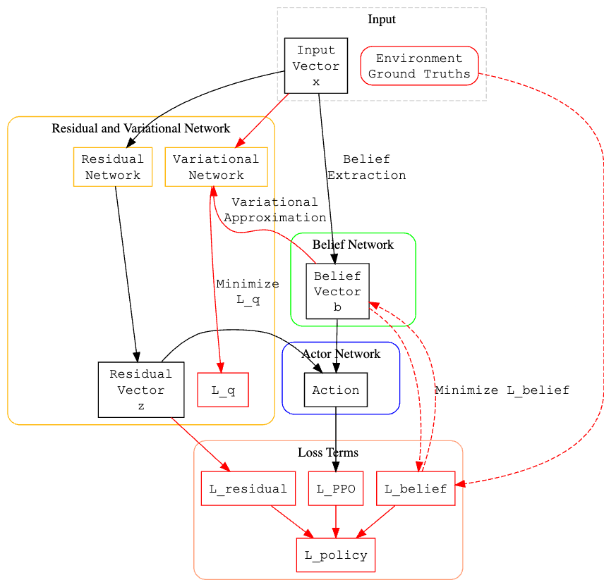

# Implementation of "Theory of Mind as Intrinsic Motivation for Multi-Agent Reinforcement Learning"

This repository contains a rough implementation of the method proposed by Oguntola et al. in their
work "Theory of Mind as Intrinsic Motivation for Multi-Agent Reinforcement Learning". We use the
Simple Adversary environment.

## Installation

Before proceeding it is important to note that this repository requires python >=3.10 to run.
```
git pull https://github.com/Shr1ftyy/belief-tom
cd belief-tom
pip install -r requirements.txt
```

## Running (WIP)
```
python algo.py
```
<!-- Duplicate the `belief.example.yaml` file and run the script.
```
cp belief.example.yaml belief.yaml
python main.py --logging_level debug --config belief.yaml
``` -->

## Contributing
At the moment, this is just a partial implementation - the belief inference and training components as well as the reward mechanics
for the agents need to be implemented and reworked. [This pull request](https://github.com/Shr1ftyy/belief-tom/pull/2) provides an
overview of the progress made towards creating a fully working implementation, and can be used as a guide to help complete the work
for anyone who may choose to pick up the torch :) .

## Diagrammatic Overview
 

Black highlights inference path given agent observations. Red highlights training. Striped red
arrows highlight the training procedure for the belief network (independent from plain red training
path).

## Preview


Blue circles are the "good" agents and the red is the adversary. The smaller circles are the
landmarks, with the green being the target landmark.
